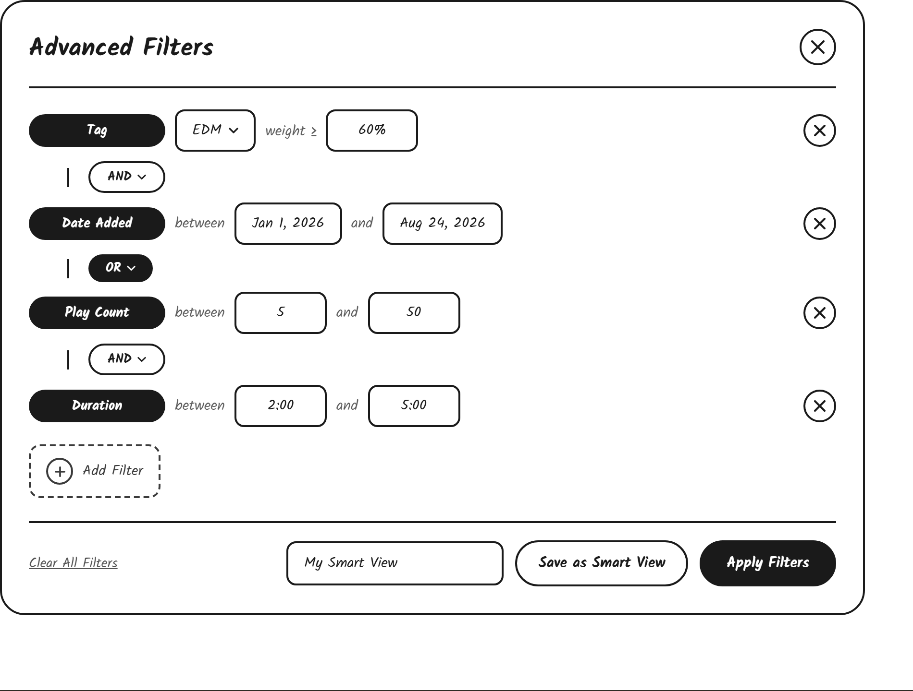

# Advanced Filter Panel UI Sketch

The advanced filter panel lets the user build a set of filters across multiple dimensions, combine them with AND/OR logic, and optionally save the whole set as a Smart View.

The top includes

- An "Advanced Filters" title aligned left
- A close button (X) aligned to the top right corner of the panel

The rest of the space includes

- A horizontal line separating the header from the rest of the panel
- A vertical list of filter rows, each representing one filter dimension, with a small circular remove button (X) aligned to the right of the row
  - A "Tag" row: a filled black pill labeling the row, a dropdown showing the chosen tag, "weight ≥" text, and a box for the minimum weight percentage
  - A "Date Added" row: a filled black pill labeling the row, "between" text, and two boxes for the start and end dates
  - A "Play Count" row: a filled black pill labeling the row, "between" text, and two boxes for the minimum and maximum play count. A "Skip Count" row would follow the same layout
  - A "Duration" row: a filled black pill labeling the row, "between" text, and two boxes for the minimum and maximum length in MM:SS
  - Between each pair of rows, a vertical connecting line leading to an "AND"/"OR" toggle pill, letting the user choose how that filter combines with the one above it. The toggle is outlined when set to "AND" and filled black when set to "OR"
- A dashed "Add Filter" button below the last row, used to add another filter dimension
- A horizontal line separating the filter rows from the panel footer
- The footer with a "Clear All Filters" text link aligned left, and aligned right, a text box for naming the filter set, a "Save as Smart View" button (outline) that saves the current filters as a persistent, dynamically re-evaluating Smart View, and an "Apply Filters" button (filled) that applies the filters to the current song list without saving them

