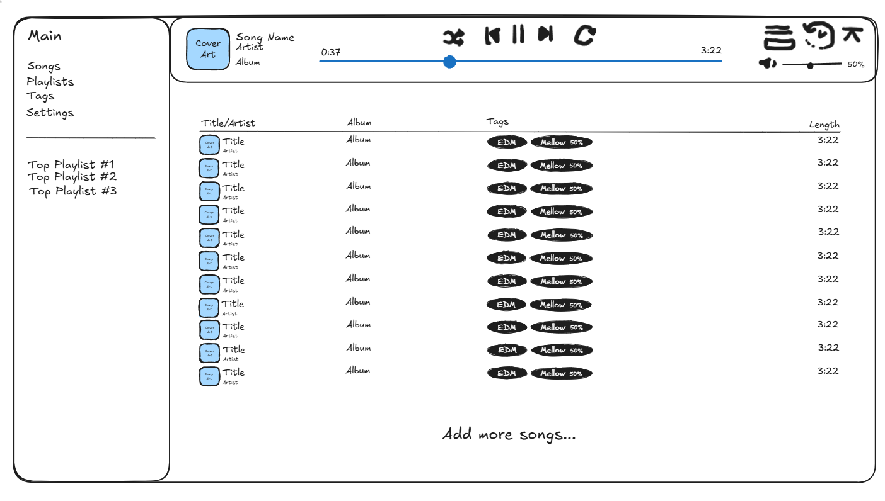

# Main App Shell UI Sketch

The main app shell wraps the entire application and is split into a left sidebar, a top playback bar, and a main content area below it.

The left sidebar includes

- A "Main" heading at the top
- A navigation list below it with "Songs", "Playlists", "Tags", and "Settings"
- A horizontal line separating the navigation list from the section below it
- A list of top playlists below the line, currently showing "Top Playlist #1", "Top Playlist #2", and "Top Playlist #3"

The top playback bar spans the width to the right of the sidebar and includes

- The square cover art for the currently playing song aligned left
- To the right of the cover art, the song name displayed in prominent text at the top, with the artist and album displayed below it in smaller text, each on their own line
- Centered playback controls including a shuffle icon, a previous track icon, a play/pause icon, a next track icon, and a repeat icon
- A progress bar below the playback controls with the current time displayed to the left, a horizontal slider with a circular handle in the middle, and the total length of the song displayed to the right
- Aligned right, a queue icon, a history icon, and an expand icon
- Below those icons, a volume icon aligned left, followed by a horizontal slider and the volume percentage aligned right

The main content area below the top playback bar includes

- The song list, matching the song list UI, but without the search bar, filter icon, and "#" column
- Below the last song row, centered text reading "Add more songs..." is displayed to let you add more songs to the list

