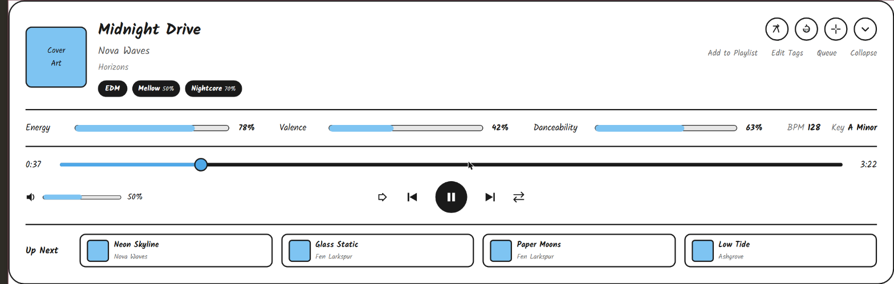

# Now Playing Bar UI Sketch

The now-playing bar is anchored at the bottom of the window and always visible. This sketch shows its expanded "full details" state, opened by clicking the expand button on the compact bar.

The top includes
- The square cover art for the currently playing song aligned left
- To the right of the cover art, the song title displayed in prominent text, with the artist and album below it in smaller text, each on their own line
- Below the title/artist/album, the tags applied to the song, shown as the same filled pills used elsewhere (tag name in white text, weight percentage in smaller text if below 100%)
- Aligned right, four circular icon buttons: "Add to Playlist" (opens a quick-select playlist picker), "Edit Tags" (opens the tag panel for the song), "Queue" (opens the full playback queue), and "Collapse" (returns to the compact now-playing bar), each labeled below the icon

The rest of the space includes
- A horizontal line separating the header from the rest of the bar
- A row of Spotify audio feature meters for the song: "Energy", "Valence", and "Danceability", each shown as a label, a horizontal bar filled to the percentage, and the percentage in bold text. The BPM and Key are displayed as plain labeled text at the end of the row
- A horizontal line separating the audio features from the playback controls
- A progress bar with the current time aligned left, a horizontal slider with a circular handle in the middle, and the total length of the song aligned right
- Below the progress bar, a row with the volume icon, a horizontal slider, and the volume percentage aligned left; centered playback controls including a shuffle icon, a previous track icon, a large filled play/pause icon, a next track icon, and a repeat icon
- A horizontal line separating the playback controls from the queue preview
- An "Up Next" section showing the next few songs in the queue as a horizontal row of cards, each with a small cover art thumbnail and the song's title/artist

