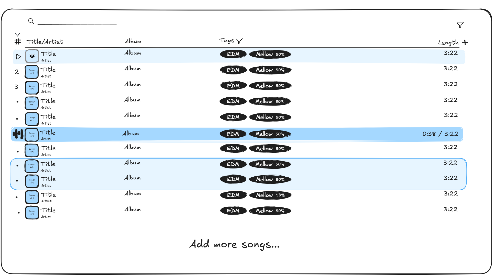

# Song List UI Sketch

The song list takes up the main content area and displays a list of songs that can be interacted with.

The top includes 
- A search bar aligned left with A magnifined glass icon on the left, followed by a long underline that stretches roughly 60 characters and when actives matches the length of the types search terms.
- A filter icon aligned to the right. Not filled in when there is no filters. Filled in with a number badge with the number of filters when filters are applied

The rest of the space includes
- The top header with all the headings for the columns. There are no borders of background colors used as visible seperators. Only spacing is used to seperate the headings. 
  - A down arrowhead is displayed above a heading when songs are sorted ascending by that heading. A up arrowhead is displayed above a heading when songs are sorted descending by that heading. Clicking the heading toggles the states.
	- A filled in filter icon is displayed beside a heading when there exists a filter applied related to it.
	- A plus sign button is displayed to the right of all the headings. That button is used to add or remove columns you want displayed. 
	- Each heading represents a seperate column. The default headings include 
		- "#" for the numbered order of the songs (e.g. 1, 2, 3)
		- "Title/Artist" where the title displayed in porminent text at the top and artist is display in a little bit smaller text below it in the same column. The cover art for the song is displayed as a square to the left of this in this column
		- "Album" where the albumn name is listed if any (Left blank if none)
		- "Tags" where the tags this song has is displayed along with the weights
		- "Length" where the length of the song is displayed as MM:SS
- A long horizontal line in between the headings and the song list
- Rows of songs for all songs displayed stacked vertically. No borders or background are used to make each row visually distinct. Only spacing. All elemnts are centered vertically and aligned left besides the duration which is always aligned right.
  - When hovered, a song row's background is light version of the primary color
	- When a song row is currently playing, its background is the primary color
	- When multiple song rows are selected, their background is a light version for the primary color with a primary color border. Adjacent selected songs do not have a border in between them 
  - The number is always displayed at the very left before the cover art in the "#" column. When a song row is hovered, the numer is replaced by a play button not filled in. That play button is filled in when hovered. When a song row is currently playing the number is replaced by an animation of 5 simple vertical bars changing heights as if it is a waveform
	- The "Title/Artist" column displays the square cover art on the very left. When a song is hovered over, the cover art fades white and an not filled in eye icon is displayed over to indicate you click on it to preview the song. When clicked, the eye icon is filled in. To the right of the cover art, the title is display aligned left and top taking about 60% of the vertical space. The artist takes about 40% of the vertical space below the title in slighty smaller text left aligned and bottom aligned.
	- The "Album" column displays the Album name if one exists, otherwise nothing. Its the same size as the title text but left aligned and vertically centered.
	- The "tags" column displays as many tags as it can as filled in colored pills with the tag name centered if the weight is 100% and left aligned if not. If the weights is <100% the weight percentage is displayer in smaller text right aligned inside the pill. The text color is white unless that doesn't contrast with the pill color. The pills are truncated if they cannot fit
	- The "Length" column shows the full length of the song in MM:SS format right aligned. If the song is currently playing is shows MM:SS / MM:SS where the left time is the current time of the song which updates real time.
- Below the last song row, centered text reading "Add more songs..." is displayed to let you add more songs to the list.

