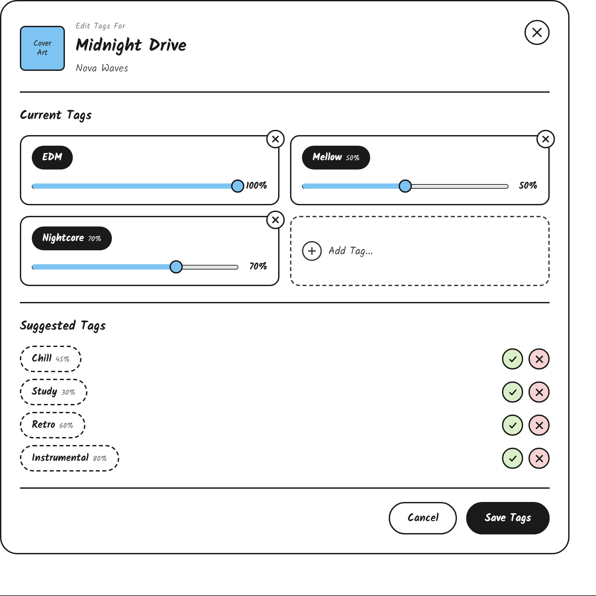

# Song Tag Panel UI Sketch

The song tag panel is a side panel that opens when a single song is clicked/selected, letting the user apply, adjust, and confirm tags for that one song.

The top includes

- The square cover art for the song aligned left
- To the right of the cover art, a small "Edit Tags For" label above the song title in prominent text, with the artist below it in smaller text
- A close button (X) aligned to the top right corner of the panel

The rest of the space includes

- A horizontal line separating the header from the rest of the panel
- A "Current Tags" heading
- A grid of cards, one per tag currently applied to the song, plus one "Add Tag..." card
  - Each tag card shows the tag as a filled pill with the tag name in white text, and the weight percentage in smaller text beside it if the weight is below 100%
  - A small circular remove button (X) sits in the top right corner of each tag card, used to remove that tag from the song entirely
  - Below the pill, a horizontal weight slider lets the user adjust that tag's weight (0-100%). The filled portion of the track and the handle are the primary color, the handle is a circle with a border. The current weight percentage is displayed in bold text to the right of the slider and updates as the slider is dragged
  - The "Add Tag..." card is dashed outline instead of solid, with a plus icon and "Add Tag..." text, used to search for and apply a new tag to the song
- A horizontal line separating the current tags from the suggested tags
- A "Suggested Tags" heading
- A vertical list of suggested tags, generated based on the artist, album, and (when available) Spotify genre/energy/valence/danceability data for the song
  - Each suggested tag is shown as a dashed outline pill (not yet filled in, to distinguish it from a confirmed tag) with the tag name and its suggested weight percentage in smaller text
  - To the right of each suggested tag, a green circular checkmark button confirms the suggestion (applying it as a current tag), and a red circular X button rejects and dismisses it
- A horizontal line separating the suggested tags from the panel footer
- The footer, aligned right, with a "Cancel" button (outline) that discards changes and a "Save Tags" button (filled) that confirms all changes made in the panel

