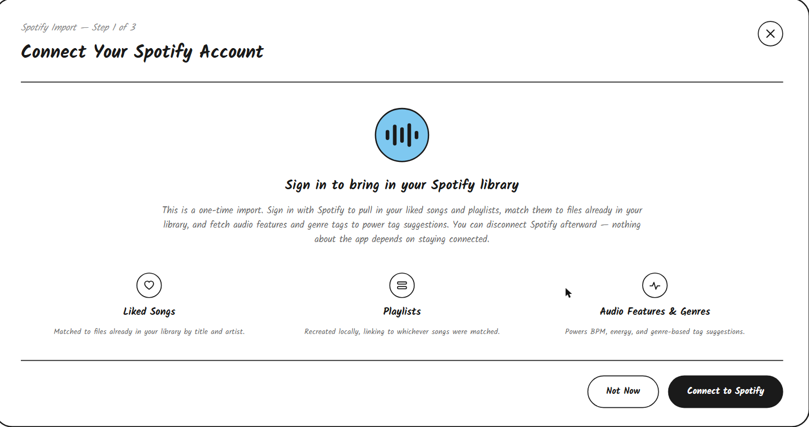
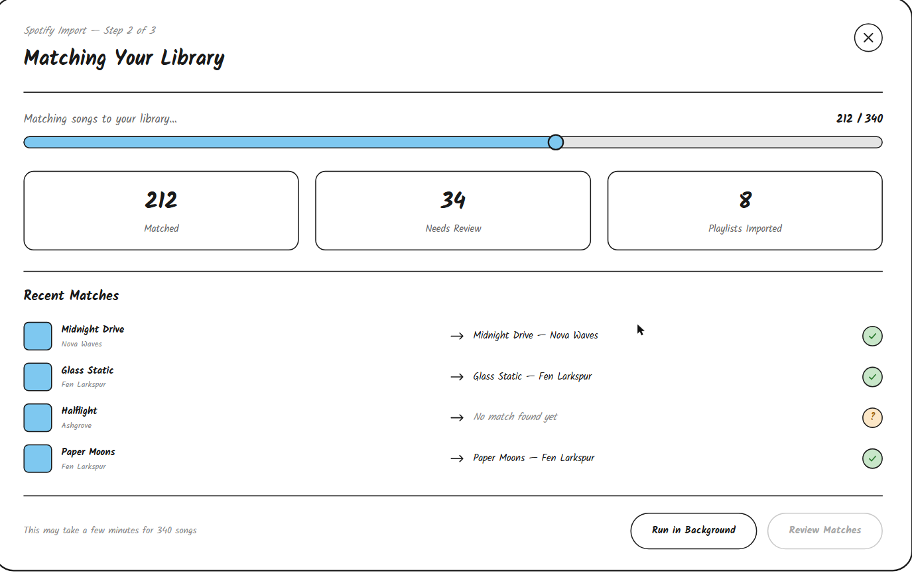
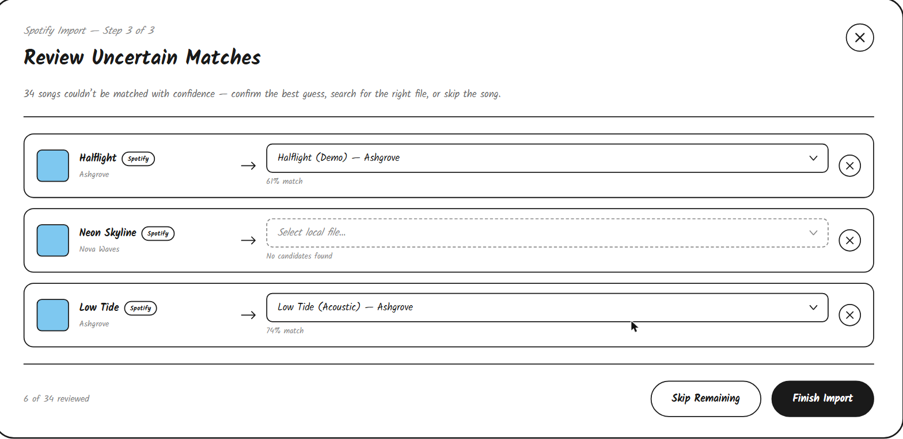

# Spotify Import Flow UI Sketch

The Spotify import flow is a one-time, three-step modal flow for connecting a Spotify account, matching the user's liked songs and playlists to local files, and resolving any songs that couldn't be matched automatically.

## Step 1: Connect Your Spotify Account

The top includes

- A "Spotify Import (Step 1 of 3)" label above a "Connect Your Spotify Account" title, both aligned left
- A close button (X) aligned to the top right corner of the panel

The rest of the space includes

- A horizontal line separating the header from the rest of the panel
- A centered intro section with a circular icon, a "Sign in to bring in your Spotify library" heading, and a paragraph explaining that this is a one-time import: liked songs and playlists are pulled in and matched to local files, audio features and genre tags are fetched to power tag suggestions, and Spotify access is optional to keep after the import finishes
- A row of three columns, each with a small circular icon, a bold label, and a description of what that piece of data is used for: "Liked Songs" (matched to local files by title and artist), "Playlists" (recreated locally, linked to whichever songs were matched), and "Audio Features & Genres" (powers BPM, energy, and genre-based tag suggestions)
- A horizontal line separating the intro from the footer
- The footer, aligned right, with a "Not Now" button (outline) that closes the flow without connecting and a "Connect to Spotify" button (filled) that starts the Spotify OAuth flow

## Step 2: Matching Your Library

The top includes

- A "Spotify Import (Step 2 of 3)" label above a "Matching Your Library" title, both aligned left
- A close button (X) aligned to the top right corner of the panel

The rest of the space includes

- A horizontal line separating the header from the rest of the panel
- A progress section with "Matching songs to your library..." aligned left and the current count aligned right (e.g. "212 / 340"), followed by a horizontal progress bar with a filled portion and a circular handle marking how far the match has gotten
- A row of three stat cards showing the running totals: "Matched", "Needs Review", and "Playlists Imported"
- A horizontal line separating the stats from the match list
- A "Recent Matches" heading followed by a list of songs as they get matched, each row showing the cover art placeholder and the Spotify title/artist on the left, an arrow pointing to the matched local title/artist (or italic grey "No match found yet" if nothing matched), and a status icon on the right: a green checkmark circle for a confirmed match or an amber question mark circle for one that needs review
- A horizontal line separating the match list from the footer
- The footer with small grey text aligned left estimating how long the import will take, and aligned right, a "Run in Background" button (outline) that lets the import continue while the user does something else, and a "Review Matches" button (filled, greyed out/disabled until the match pass finishes) that advances to Step 3

## Step 3: Review Uncertain Matches

The top includes

- A "Spotify Import (Step 3 of 3)" label above a "Review Uncertain Matches" title, both aligned left
- A close button (X) aligned to the top right corner of the panel
- Below the header, a line of grey text stating how many songs couldn't be matched with confidence and explaining the user can confirm the best guess, search for the right file, or skip the song

The rest of the space includes

- A horizontal line separating the intro text from the review list
- A vertical list of rows, one per unmatched or low-confidence Spotify track
  - Each row shows the cover art placeholder, the Spotify track title with a small outline "Spotify" pill beside it, and the artist below in smaller text
  - An arrow points from the Spotify track info to a dropdown on the right showing the best-guess local file match (or a dashed, italic "Select local file..." placeholder if no candidate was found), with the match confidence percentage (or "No candidates found") in small grey text below the dropdown
  - A small circular X button sits at the far right of each row to skip that song and exclude it from the import
- A horizontal line separating the review list from the footer
- The footer with small grey text aligned left showing how many songs have been reviewed so far, and aligned right, a "Skip Remaining" button (outline) that finishes the import without resolving the rest, and a "Finish Import" button (filled) that completes the import with the current matches

