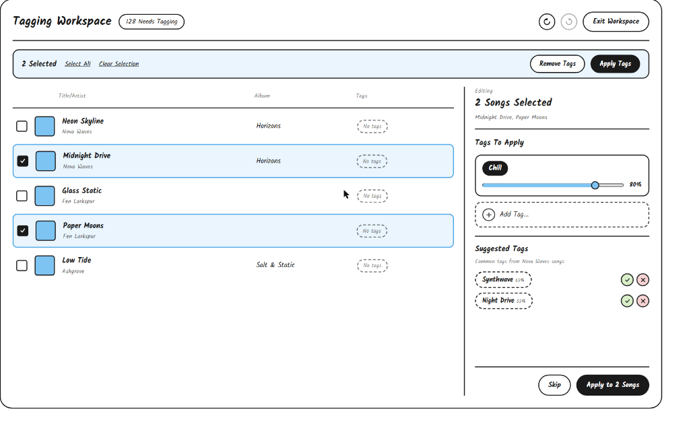

# Tagging Workspace UI Sketch

The Tagging Workspace is a separate, distraction-free full-view mode (no library sidebar or now-playing bar) optimized for efficiently processing songs in the "Needs Tagging" queue in bulk.

The top includes

- A "Tagging Workspace" title aligned left, followed by a pill showing the number of songs remaining in the "Needs Tagging" queue
- Aligned right, undo and redo circular icon buttons for reverting or reapplying tagging actions, followed by an "Exit Workspace" button that returns to the main library view

The rest of the space includes

- A horizontal line separating the header from the rest of the workspace
- A bulk toolbar with a light primary-color background, shown whenever one or more songs are selected
  - Aligned left, the number of songs selected, followed by "Select All" and "Clear Selection" text links
  - Aligned right, a "Remove Tags" button (outline) and an "Apply Tags" button (filled), which apply the bulk action in the tag panel to every selected song at once
- A song queue list on the left, matching the song list UI but with a checkbox added to the left of each row for multi-select, and no numbering or duration/BPM columns
  - Selected rows are highlighted with a light primary-color background and primary-color border, matching the multi-select convention from the song list
  - Since every song in this queue has zero confirmed tags, the "Tags" column shows a dashed, greyed-out "No tags" pill instead of any tag pills
- A vertical line separating the song queue from the tag panel
- The tag panel integrated on the right, adapted for editing the selected songs together instead of a single song
  - A small "Editing" label above the count of songs selected, with the selected songs' titles listed below it in smaller text
  - A "Tags To Apply" heading with the same tag cards (filled pill, weight slider, remove button) and "Add Tag..." control as the single-song tag panel, applying the tag and weight to every selected song
  - A "Suggested Tags" heading with a small subtitle explaining the suggestions come from tags common to other songs by the same artist, followed by the same dashed pill suggestions with accept/reject buttons as the single-song tag panel
  - A footer, aligned right, with a "Skip" button that moves on without tagging the selected songs and an "Apply to [N] Songs" button that confirms the bulk changes

